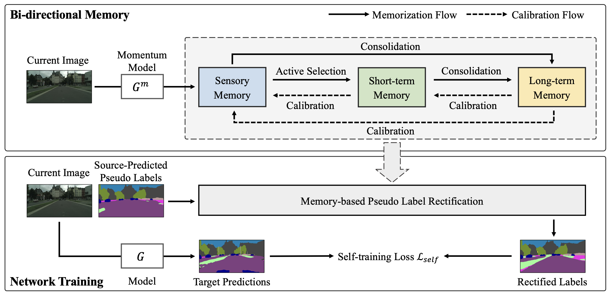

# Black-box Unsupervised Domain Adaptation with Bi-directional Atkinson-Shiffrin Memory (ICCV 2023)

### [Paper](https://openaccess.thecvf.com/content/ICCV2023/papers/Zhang_Black-Box_Unsupervised_Domain_Adaptation_with_Bi-Directional_Atkinson-Shiffrin_Memory_ICCV_2023_paper.pdf)



## Abstract
Black-box unsupervised domain adaptation (UDA) learns with source predictions of target data without accessing either source data or source models during training, and it has clear superiority in data privacy and flexibility in target network selection. However, the source predictions of target data are often noisy and training with them is prone to learning collapses. We propose BiMem, a bidirectional memorization mechanism that learns to remember useful and representative information to correct noisy pseudo labels on the fly, leading to robust black-box UDA that can generalize across different visual recognition tasks. BiMem constructs three types of memory, including sensory memory, short-term memory, and long-term memory, which interact in a bi-directional manner for comprehensive and robust memorization of learnt features. It includes a forward memorization flow that identifies and stores useful features and a backward calibration flow that rectifies features’ pseudo labels progressively. Extensive experiments show that BiMem achieves superior domain adaptation performance consistently across various visual recognition tasks such as image classification, semantic segmentation and object detection.

## Installation
Install dependencies:
```bash
pip install -r requirements.txt
```
## Data Preparation 
Download [Cityscapes](https://www.cityscapes-dataset.com/), [GTA5](https://download.visinf.tu-darmstadt.de/data/from_games/) and [SYNTHIA-RAND-CITYSCAPES](http://synthia-dataset.net/downloads/).

```
└── dataset
    ├── cityscapes
    │   ├── annotations
    │   ├── gtFine
    │   └── leftImg8bit
    ├── GTA5
    │   ├── images
    │   ├── labels
    │   └── split.mat
    ├── SYNTHIA
    │   ├── GT
    │   ├── RGB
    └── └── meta.json
```

## Traning

### Warm-up stage
```bash
python train.py --name gta2citylabv2_baseline --used_save_pseudo --path_soft path-to-source-model-predicted-pseudo-labels --stage 'baseline' --proto_rectify --no_resume --freeze_bn --lr 2.5e-4
```
### Training stage
- Generate initial prototypes
```bash
python calc_prototype.py --resume_path path-to-warm-up-model.pkl
```
- Train the model
```bash
python train.py --name gta2citylabv2_stage1Denoise --used_save_pseudo --ema --proto_rectify --moving_prototype --path_soft path-to-source-model-predicted-pseudo-labels --resume_path path-to-warm-up-model.pkl --rce
```

## Citation
We appreciate your citations if you find our paper related and useful to your research!
```
@InProceedings{Zhang_2023_ICCV,
    author    = {Zhang, Jingyi and Huang, Jiaxing and Jiang, Xueying and Lu, Shijian},
    title     = {Black-Box Unsupervised Domain Adaptation with Bi-Directional Atkinson-Shiffrin Memory},
    booktitle = {Proceedings of the IEEE/CVF International Conference on Computer Vision (ICCV)},
    month     = {October},
    year      = {2023},
    pages     = {11771-11782}
}
```
## Acknowledgments
This code is heavily borrowed from [ProDA](https://github.com/microsoft/ProDA).
